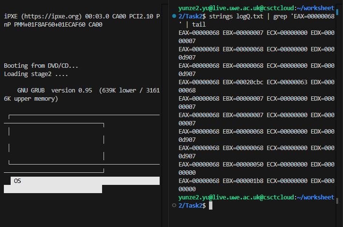

# Loader
```asm

global loader                            ; expose the symbol 'loader' to the linker as the entry point
extern kmain                             ; tell the assembler that kmain is defined in another C file

MAGIC_NUMBER     equ 0x1BADB002          ; Multiboot magic number
FLAGS            equ 0x0                 ; Multiboot flags
CHECKSUM         equ -MAGIC_NUMBER       ; checksum: MAGIC + FLAGS + CHECKSUM = 0

KERNEL_STACK_SIZE equ 4096               ; kernel stack size: 4KB

section .text                            ; code section
align 4                                  ; align to 4 bytes
    dd MAGIC_NUMBER                      ; magic number
    dd FLAGS                             ; flags
    dd CHECKSUM                          ; checksum

section .bss                             ; uninitialized data section, used for stack space
align 4                                  ; align to 4 bytes

kernel_stack:                            ; label for the bottom of the kernel stack
    resb KERNEL_STACK_SIZE               ; reserve KERNEL_STACK_SIZE bytes as stack space

loader:                                  ; kernel entry point
    mov esp, kernel_stack + KERNEL_STACK_SIZE ; set ESP to the top of the stack

    call kmain                           ; call the C function kmain

.loop:                                   ; infinite loop label
    jmp .loop                            ; never return, keep the final value of EAX unchanged

```
# Kmain.c
```asm

 int sum_of_three(int arg1, int arg2, int arg3)   ; small declaration: compute the sum of three integers
 int multiply(int a, int b)                       ; small declaration: multiply two integers
 int get_string_length(const char* str)           ; small declaration: compute the length of a string

int kmain()                                       ; kernel C entry point
{
    int result1 = sum_of_three(10, 20, 30)        ; 60  call C function, get 10+20+30 = 60

    int result2 = multiply(5, 7)                  ; 35 compute 5*7 = 35

    const char* test_string = "Hello OS!"         ; define a test string constant
    
    int result3 = get_string_length(test_string)  ; 9 string length = 9 characters

    return result1 + result2 + result3            ; return 104
}
```
The GRUB bootloader loads the kernel's Multiboot header and begins execution;The assembly-based loader sets up the kernel stack and invokes the C function kmain();The sum of the return values of three functions within kmain() yields 104.

