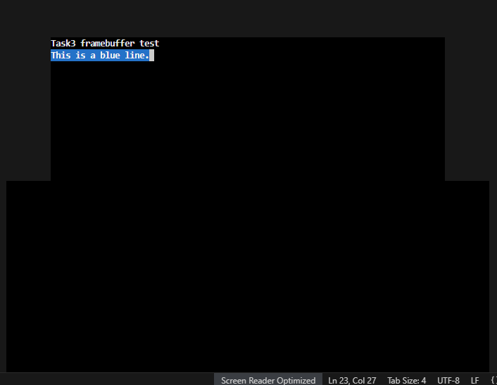

# 1.loader.asm
```asm
global loader
extern kmain

MAGIC_NUMBER       equ 0x1BADB002
FLAGS              equ 0x0
CHECKSUM           equ -(MAGIC_NUMBER + FLAGS)

; Kernel stack size （内核栈大小）
KERNEL_STACK_SIZE  equ 4096

section .bss
align 4
kernel_stack:
    resb KERNEL_STACK_SIZE           ; Reserve 4KB of stack space

section .text
align 4
    dd MAGIC_NUMBER                  ; Multiboot magic number
    dd FLAGS                         ; flag bit
    dd CHECKSUM                      ; sum

loader:
    ; First, point the stack pointer to the top of the stack we have prepared ourselves.先把栈指针指到我们自己准备好的栈顶
    mov esp, kernel_stack + KERNEL_STACK_SIZE

    ; 测试：直接往显存写几个字符
    mov edi, 0xB8000                 ; VGA Starting address of text mode video memory
    mov byte [edi],   'A'
    mov byte [edi+1], 0x07           ; 0x07：Black background with gray text
    mov byte [edi+2], 'S'
    mov byte [edi+3], 0x07
    mov byte [edi+4], 'M'
    mov byte [edi+5], 0x07

    ;Jump to the kernel entry written in C
    call kmain

.hang:
    jmp .hang                        ; Prevent running around after returning
```
The first three 'dd's are "identifiers" for GRUB, telling GRUB that this is a program that can be booted as a kernel.
prepare a 4KB stack in the .bss section, then point esp to it for use by subsequent C functions.
Directly write A, S, M and color bytes to 0xB8000 to display "ASM" in the upper left corner of the screen, confirming that the loader is indeed running. Finally, call kmain to jump to the entry function in C. If by any chance we return from kmain in the future, we will hang in an infinite loop to prevent the CPU from running amok.



# 2 io.h io.asm
```asm
//
void outb(unsigned short port, unsigned char data);

io.h - simple I/O port helpers for x86(一些简单的 x86 I/O 端口辅助函数)
Write one byte to the given I/O port.（向指定的 I/O 端口写入一个字节）
port: I/O port numberport：I/O （端口号）
data: byte to send to that port （要发送到该端口的字节）
//
unsigned char inb(unsigned short port);

Read one byte from the given I/O port.端口读取一个字节
port: I/O port number端口号
returns: the byte read from that port返回值：从该端口读到的字节
```

```asm
io.asm - simple wrappers around x86 in/out instructions对 x86 in/out 指令的简单封装
global outb
global inb

; void outb(unsigned short port, unsigned char data);
; Write the byte 'data' to I/O port 'port'.向 I/O 端口 'port' 写入一个字节 'data'
outb:
    mov al, [esp + 8]    ; load second argument (data) into AL把第二个参数 data 装入 AL
    mov dx, [esp + 4]    ; load first argument (port) into DX把第一个参数 port 装入 DX
    out dx, al           ; send AL to the port in DX将 AL 的值输出到 DX 指定的端口
    ret                  ; return to caller返回调用者
                       

; unsigned char inb(unsigned short port);
; Read one byte from I/O port 'port' and return it.
; 从 I/O 端口 'port' 读取一个字节并作为返回值。
inb:
    mov dx, [esp + 4]    ; load first argument (port) into DX把第一个参数 port 装入 DX
    in  al, dx           ; read a byte from port DX into AL从 DX 指定的端口读一个字节到AL
    ret                  ; AL holds the return value返回时，AL 中的值就是函数返回值
```
1.io.h is the "function declaration" for C, telling the compiler that there are two functions: outb writes 1 byte to a certain port, and inb reads 1 byte from a port.

2.The actual implementation is in io.asm, which uses x86's out / in instructions to interact with hardware. The parameters are fetched from the stack according to the cdecl rules:
[esp+4] is the first parameter, port,
[esp+8] is the second parameter, data.

# kmain.c
```asm
void kmain(void) 
{
    fb_init();      // Initialize the frame buffer初始化帧缓冲
    fb_clear();     // Clear the screen again to ensure it's clean.再清一次屏，保证干净

    Line 0: Basic output (gray text on black background);第0行：基础输出（灰字黑底）
    fb_set_color(FB_WHITE, FB_BLACK);
    fb_move_cursor_xy(0, 0);
    fb_print_string("Task3 framebuffer test");

    Line 1: A blue example (white text on a blue background);第 1 行：一个蓝色示例（白字蓝底）
    fb_set_color(FB_WHITE, FB_BLUE);
    fb_move_cursor_xy(0, 1);
    fb_print_string("This is a blue line.");

    //Prevent return防止返回
    while (1);
}
kmain is the C language kernel entry point, called by the loader.
Call fb_init / fb_clear to ensure the screen is cleared and the cursor is in the correct position.
Set the color to white text on a black background, and output the title "Task3 framebuffer test" on line 0.
Change the background color to blue, then output "This is a blue line." on line 1 to demonstrate the effect of different color lines on the same screen.
Finally, enter an infinite loop to prevent returning from the kernel to an unknown address.
```

# fb.c
```asm
#include "fb.h"
#include "../source/io.h"

  uint8_t fb_fg = FB_WHITE;
  uint8_t fb_bg = FB_BLACK;
// Current foreground / background color (default: white on black)

  static uint16_t fb_cursor_x = 0; //逻辑光标的位置（第几列、第几行），从 0 开始计数。
  static uint16_t fb_cursor_y = 0;
// Current cursor position (in character cells)

  static volatile uint8_t *fb = (uint8_t *)FB_ADDRESS;
// Framebuffer base address in text mode: 0xB8000
// Each character cell uses 2 bytes: [char][attribute]

  把 (x,y) 变成一维下标
  static uint16_t fb_pos(uint16_t x, uint16_t y) {
    return y * FB_COLS + x;
}// Convert (x, y) to a linear position index

写一个“格子”：字符 + 颜色
  static void fb_write_cell(uint16_t pos, char c, uint8_t fg, uint8_t bg) {
    字符fb[pos * 2]     = (uint8_t)c;                // character byte
    颜色属性fb[pos * 2 + 1] = (bg << 4) | (fg & 0x0F);   // attribute byte: high 4 bits = bg, low 4 bits = fg
}
// Write a character + color attribute to cell at position pos

    static void fb_update_cursor(void) {
    uint16_t pos = fb_pos(fb_cursor_x, fb_cursor_y);
// Update the hardware cursor using VGA I/O ports (textbook code)

    outb(FB_CMD_PORT, FB_HIGH_BYTE_CMD);         // select high byte register (0x3D4, 14)
    outb(FB_DATA_PORT, (pos >> 8) & 0xFF);
// Write high 8 bits of the cursor position告诉显卡：我要改“光标位置的高 8 位

    outb(FB_CMD_PORT, FB_LOW_BYTE_CMD);          // select low byte register (0x3D4, 15)
    outb(FB_DATA_PORT, pos & 0xFF);
}
// Write low 8 bits of the cursor position我要改“光标位置的低 8 位

// Initialization: Set default color, clear the screen, reset the cursor to zero初始化：设置默认颜色，清屏，光标归零
void fb_init(void); // Clear screen: Use the current color to paint the entire screen with spaces.清屏：用当前颜色把整屏刷成空格
void fb_clear(void);// 设置之后打印用的前景色 / 背景色The foreground color / background color used for printing after setting
void fb_set_color(uint8_t fg, uint8_t bg);// 把光标移动到 (x, y)，并调用 fb_update_cursor() 更新硬件光标
void fb_move_cursor_xy(uint16_t x, uint16_t y);// 从当前光标位置开始输出一个字符串，自动推进光标
void fb_print_string(const char *str);
